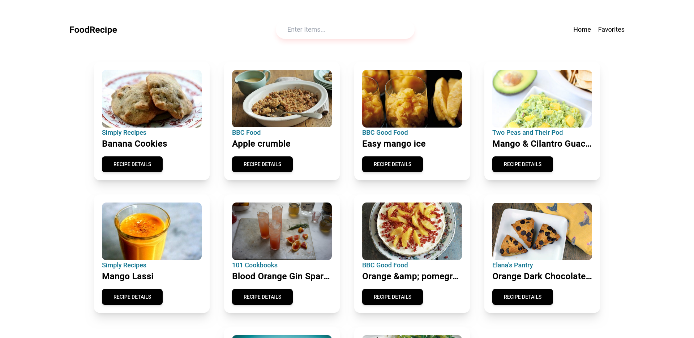
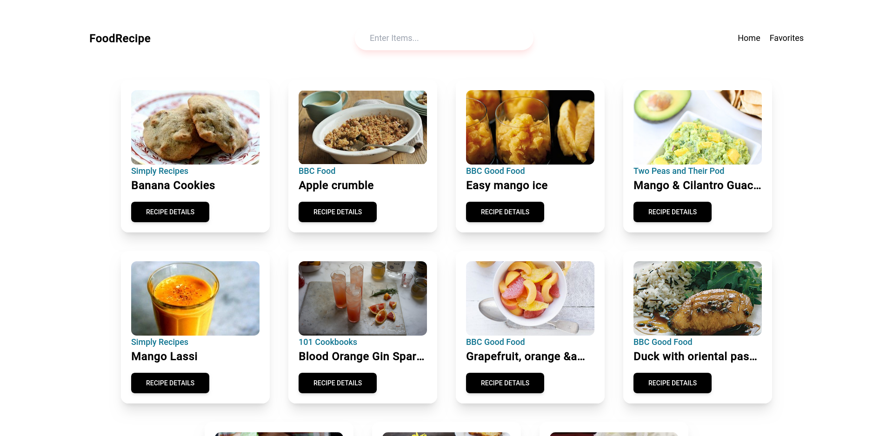
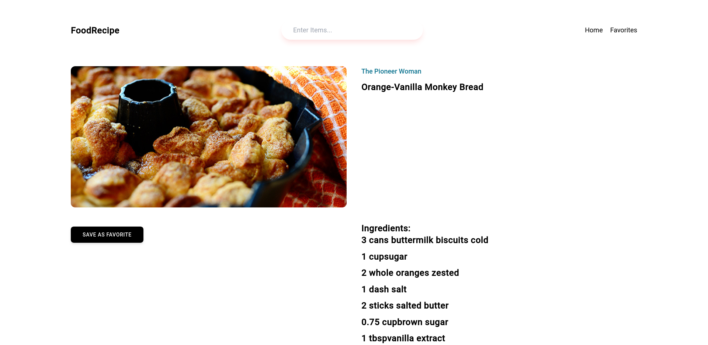

### Recipe.app

😊 This is 22th of Course Build 25 Project on FreeCodeCamp using React Js.

#### favorites Recipes

#### Recipes

#### Recipes Details

😎This is awesome project because it's covers concepts likes react-router-dom, useContext to manage global state, navigate, link and useParams to pass params when to shows more details about recipe item in details page. 🙏

✍ : "Tic tac tic tac .... something else 🍵"
